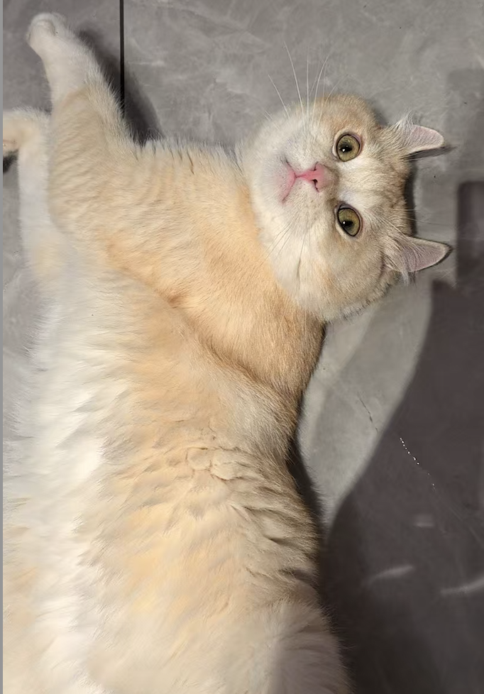

## **Overview**
Hi, this is Ziqi Guo. I am a second year MPH student at Mailman School of Public Health in Columbia University. After I got a bachelor’s degree in Pharmaceutical Science at Purdue University, I worked as a lab assistant at Hunan Province Directly
Affiliated TCM Hospital and started an impressive journey to explore the mechanism of
cardiovascular disease and identify its high-risk demographic group, where I confirmed my
determination to be an epidemiologist in health economics and outcomes research field.

## **Hobby**
*Baking* 

## **Pet**
Juanza!!

